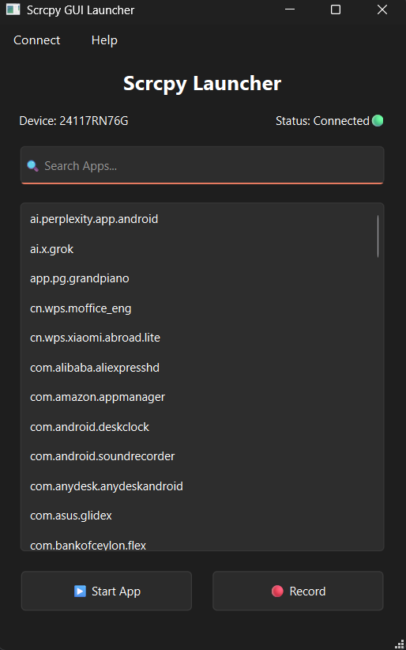

# 📱 Scrcpy GUI Launcher

A modern **Windows desktop GUI** for launching Android apps using **scrcpy + ADB** — no terminal typing, no hassle.

Built with **Python + PySide6**.

---

## ✨ Features

- 📋 List installed Android apps
- 🔍 Live search (filter apps instantly)
- ▶️ Launch apps in a new display
- 🎥 Record screen with timestamped files
- 📡 Automatic ADB Wi-Fi connect
- 🔌 Manual ADB connect (IP + port)
- 📱 Device status indicator (Connected / Offline / Unauthorized)
- 🧠 Detects missing tools automatically
- 🖥️ Clean, modern UI (Qt Designer)

---

## 🖼️ Screenshots

```
assets/
 ├── main-ui.png
 ├── manual-connect.png
 └── recording.png
```

<p align="center">
  
</p>

---

## 🚀 Getting Started

### 1️⃣ Download the App

Download the latest release from **GitHub Releases**.

### 2️⃣ Download scrcpy

scrcpy is required.

👉 https://github.com/Genymobile/scrcpy

Extract scrcpy and place files like this:

```
ScrcpyLauncher/
├── ScrcpyLauncher.exe
├── tools/
│   ├── adb.exe
│   ├── scrcpy.exe
│   ├── SDL2.dll
│   └── ffmpeg DLLs...
```

### 3️⃣ Enable Developer Options on Phone

- Enable **USB debugging**
- (Optional) Enable **Wireless debugging**

### 4️⃣ Run the App

Double-click `ScrcpyLauncher.exe` 🎉

---

## ⚙️ Requirements

- Windows 10 / 11 (64-bit)
- Android device with USB or Wi-Fi debugging enabled
- scrcpy + adb (not bundled)

---

## 🧠 How It Works

- Uses **ADB** to detect devices and installed apps
- Uses **scrcpy** to mirror & launch apps
- GUI built with **PySide6 (Qt for Python)**
- No system PATH modification required
- Portable — no installer needed

---

## 🛠️ Built With

- Python 3
- PySide6 (Qt)
- scrcpy
- Android Debug Bridge (ADB)

---

## 📦 Project Structure

```
Scrcpy-GUI-Launcher/
│
├── main.py
├── main.ui
├── manual.ui
├── README.md
├── .gitignore
│
├── assets/
│   └── screenshots
```

---

## ❗ Notes

- scrcpy and adb are **not included** in this repository
- This project does **not modify system PATH**
- All tools are run locally from the `tools/` folder

---

## 🧩 Roadmap

- ⏳ Auto-download scrcpy
- 🎨 App icons instead of package names
- 📱 Multiple device selector
- 🔄 Auto-refresh device status
- 🧾 Log viewer
- 🖱️ Tray mode

---

## 🤝 Contributing

Contributions, ideas, and suggestions are welcome!

1. Fork the repo
2. Create a feature branch
3. Submit a pull request

---

## 📄 License

This project is for **educational and personal use**.

scrcpy is licensed separately by its authors.

---

## ⭐ Support

If you like this project, consider giving it a **star ⭐** on GitHub!
